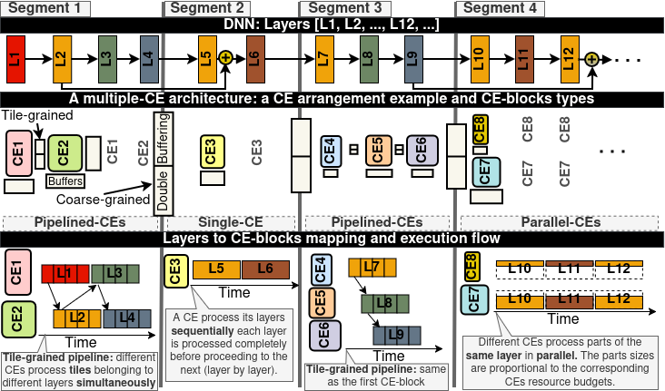
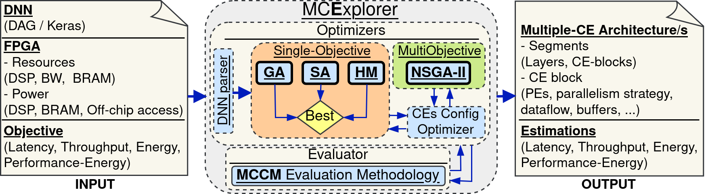

# MCExplorer: Exploring the Design Space of Multiple Compute-Engine Deep Learning Accelerators

This repository contains an implementation [MCExplorer: Exploring the Design Space of Multiple Compute-Engine Deep Learning Accelerators](https://dl.acm.org/doi/abs/10.1145/3774913)

If you find this repository useful for your research, we would appreciate it if you could cite our work using the following BibTeX entry:

```
@article{qararyah2025mcexplorer,
  title={MCExplorer: Exploring the Design Space of Multiple Compute-Engine Deep Learning Accelerators},
  author={QARARYAH, FAREED and Maleki, Mohammad Ali and Trancoso, Pedro},
  journal={ACM Transactions on Architecture and Code Optimization},
  year={2025},
  publisher={ACM New York, NY}
}
```

**Note:**  MCExplorer relies on the **MCCM** cost model, which is described in detail [here](https://github.com/fqararyah/MCExplorer).


## Multiple-CE Accelerators
We use the term **multiple Compute-Engine (multiple-CE)** accelerators to describe accelerators that organize FPGA resources into an adjustable number of dedicated Compute Engines (CEs). These multiple-CE accelerators adjust the number of CEs to optimize performance and/or efficiency metrics based on the structure of the CNN model and the available FPGA resources. Multiple-CE accelerators can be seen as compositions of basic building blocks like *single-CE*, *pipelined-CEs*, and *parallel-CEs* as shown in Figure 1.

*Figure 1: DNN to a multiple-CE architecture mapping example. The example shows 4 segments that divide the figure vertically, and three sections that divide the figure horizontally. The sections show DNN layers, the types of CE-blocks used, and the mapping and execution flow of the layers on their CE-blocks. CEs and buffers vary in size and shape, proportional to their segment layers' needs..*

Exploring all possible designs for multiple-CE accelerators is impractical, so prior work has limited the design space in two main ways. First, they use fixed CE arrangements and only adjust the number of CEs based on the DNN and hardware budget. Second, they typically apply a single parallelism strategy and dataflow across all CEs, tuning only the degree of parallelism. For example, all CEs might be implemented as systolic arrays with the same strategy and dataflow, differing only in shape. Even when heterogeneous strategies are used, they are usually fixed rather than determined through exploration. These restrictions often lead to state-of-the-art accelerators being outperformed even by random design space exploration.

To address these limitations, we propose **MCExplorer**, a framework for **DSE** of **FPGA-based multiple-CE accelerators**. MCExplorer automates the **search for optimized accelerator** designs based on a given **DNN**, **FPGA resources**, and custom **optimization objectives**. Unlike prior approaches, it explores a broader design space without restricting CE arrangements and allows multiple distinct per-CE configurations, including parallelism strategies and dataflow options. Figure 2 shows an overview of MCExplorer.

**Note:** There are a few terminology mismatches between the conceptual overview in the paper/figures and the actual code.  
For example, the code uses the term *mapping* to refer to multiple-CE accelerators, since each accelerator design is essentially a mapping of a CNN onto hardware. Another example is that the **CE Config Optimizer** shown in Figure 2 is not implemented as a standalone module in the code; its implementation is spread across [`engine.py`](engines/engine.py), [mapping utils](mapping_utils/), and various [mapping types](mapping_types/).


*Figure 2: MCExplorer conceptual overview